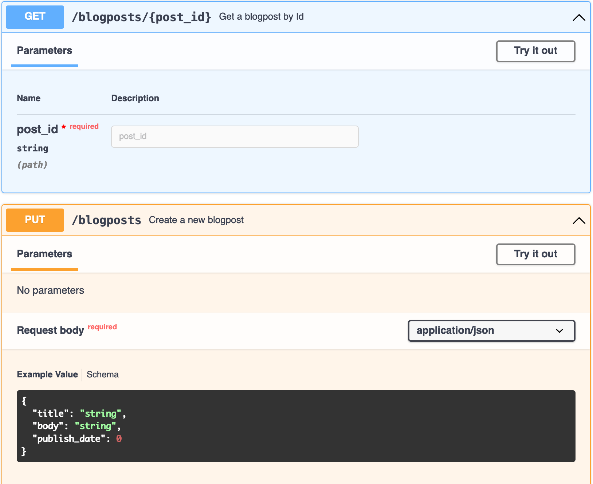

openapi-fetch applies your OpenAPI types to the native fetch API via TypeScript. Weighs in at **2 kb** and has virtually zero runtime. Works with React, Vue, Svelte, or vanilla JS.

| Library                        | Size (min) |
| :----------------------------- | ---------: |
| **openapi-fetch**              |     `2 kB` |
| **openapi-typescript-fetch**   |     `4 kB` |
| **openapi-typescript-codegen** |   `345 kB` |

The syntax is inspired by popular libraries like react-query or Apollo client, but without all the bells and whistles and in a 1 kb package.

```ts
import createClient from "openapi-fetch";
import { paths } from "./v1"; // (generated from openapi-typescript)

const { GET, POST } = createClient<paths>({ baseUrl: "https://myapi.dev/v1/" });

// Type-checked request
await POST("/create-post", {
  body: {
    title: "My New Post",
    // ❌ Property 'publish_date' is missing in type …
  },
});

// Type-checked response
const { data, error } = await GET("/blogposts/my-blog-post");

console.log(data.title); // ❌ 'data' is possibly 'undefined'
console.log(error.message); // ❌ 'error' is possibly 'undefined'
console.log(data?.foo); // ❌ Property 'foo' does not exist on type …
```

Notice **there are no generics, and no manual typing.** Your endpoint’s exact request & response was inferred automatically off the URL. This makes a **big difference** in the type safety of your endpoints! This eliminates all of the following:

- ✅ No typos in URLs or params
- ✅ All parameters, request bodies, and responses are type-checked and 100% match your schema
- ✅ No manual typing of your API
- ✅ Eliminates `any` types that hide bugs
- ✅ Also eliminates `as` type overrides that can also hide bugs
- ✅ All of this in a **1 kB** client package 🎉

## 🔧 Setup

Install this library along with [openapi-typescript](../openapi-typescript):

```bash
npm i openapi-fetch
npm i -D openapi-typescript
```

Next, generate TypeScript types from your OpenAPI schema using openapi-typescript:

```bash
npx openapi-typescript ./path/to/api/v1.yaml -o ./src/lib/api/v1.d.ts
```

> ⚠️ Be sure to <a href="https://redocly.com/docs/cli/commands/lint/" target="_blank" rel="noopener noreferrer">validate your schemas</a>! openapi-typescript will err on invalid schemas.

Lastly, be sure to **run typechecking** in your project. This can be done by adding `tsc --noEmit` to your <a href="https://docs.npmjs.com/cli/v9/using-npm/scripts" target="_blank" rel="noopener noreferrer">npm scripts</a> like so:

```json
{
  "scripts": {
    "test:ts": "tsc --noEmit"
  }
}
```

And run `npm run test:ts` in your CI to catch type errors.

> ✨ **Tip**
>
> Always use `tsc --noEmit` to check for type errors! Your build tools (Vite, esbuild, webpack, etc.) won’t typecheck as accurately as the TypeScript compiler itself.

## 🏓 Usage

Using **openapi-fetch** is as easy as reading your schema:



Here’s how you’d fetch GET `/blogposts/{post_id}` and PUT `/blogposts`:

```ts
import createClient from "openapi-fetch";
import { paths } from "./v1";

const { GET, PUT } = createClient<paths>({ baseUrl: "https://myapi.dev/v1/" });

const { data, error } = await GET("/blogposts/{post_id}", {
  params: {
    path: { post_id: "my-post" },
    query: { version: 2 },
  },
});

const { data, error } = await PUT("/blogposts", {
  body: {
    title: "New Post",
    body: "<p>New post body</p>",
    publish_date: new Date("2023-03-01T12:00:00Z").getTime(),
  },
});
```

## 📓 Docs

[View Docs](https://openapi-ts.pages.dev/openapi-fetch/)
